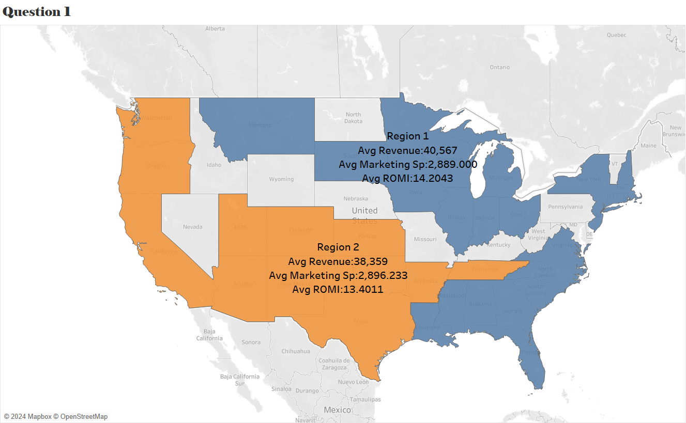
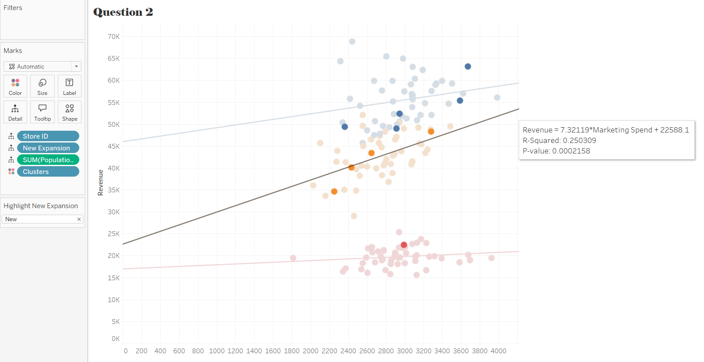

# 📈 WeWashUSleep Case Study – Tableau Dashboard
**Analysing Regional Sales Performance and Marketing ROI**

---

## 🧠 Overview
This project showcases a **Tableau dashboard** for *WeWashUSleep*, evaluating sales performance across two regions and identifying new cities with high potential for marketing investment.  
It combines **maps, clustering, and ROI calculations** to highlight regional efficiency and strategic opportunities for future investment.

---

## 🚀 Project Objective
To identify **top-performing sales regions** and **high-potential cities** using ROI-based analysis, enabling **data-driven marketing decisions**.

---

## 📊 Key Insights

- **Regional Performance:** Region 1 outperforms Region 2 in all key metrics:  
  - Higher average revenue per city  
  - Lower average marketing spend per city  
  - Superior average ROMI (Return on Marketing Investment)  

- **High-Potential Cities:** Using clustering analysis of marketing spend, revenue, and population:  
  - 🟡 **Yellow Cluster:** $7.32 ROI per dollar spent → *Optimal for investment*  
  - 🔵 **Blue Cluster:** $3.17 ROI per dollar spent  
  - 🔴 **Red Cluster:** $0.94 ROI per dollar spent *(low ROI, caution)*  

Despite higher total revenue in the Blue Cluster, the Yellow Cluster demonstrates nearly **double the ROI**, indicating the **best potential for marketing investment**.

---

## 🔄 Interactivity
The dashboard includes **maps, clustered charts, and dynamic labels**, allowing users to explore **regional performance and city-level investment potential** interactively.

---

## 🛠️ Tools Used
- **Tableau Desktop** (visualisation and dashboard creation)  
- **Microsoft Excel / CSV** (data preparation and joins)

---

## 📸 Dashboard Preview
*(Upload your Tableau dashboard screenshot and replace the path below)*  

  

- **High-Potential Cities:** Using clustering analysis of marketing spend, revenue, and population:  
  - 🟡 **Yellow Cluster:** $7.32 ROI per dollar spent → *Optimal for investment*  
  - 🔵 **Blue Cluster:** $3.17 ROI per dollar spent  
  - 🔴 **Red Cluster:** $0.94 ROI per dollar spent *(low ROI, caution)*  

Despite higher total revenue in the Blue Cluster, the Yellow Cluster demonstrates nearly **double the ROI**, indicating the **best potential for marketing investment**.

---

## 🔄 Interactivity
The dashboard includes **maps, clustered charts, and dynamic labels**, allowing users to explore **regional performance and city-level investment potential** interactively.

---

## 🛠️ Tools Used
- **Tableau Desktop** (visualisation and dashboard creation)  
- **Microsoft Excel / CSV** (data preparation and joins)

---

## 📸 Dashboard Preview
*(Upload your Tableau dashboard screenshot and replace the path below)*  

---

## 🔗 View the Live Dashboard
Explore it here → [WeWashUSleep Tableau Dashboard](https://lnkd.in/dcQcB9Hu)

---

## 💡 Key Learnings
- Developed skills in **ROI-based performance analysis**  
- Hands-on experience with **interactive maps and cluster visualisations**  
- Improved ability to **translate data into actionable business decisions**

---

## 🔗 Connect with Me
Discuss dashboards, Tableau, or marketing analytics:  
👉 [LinkedIn – Manjot Singh](https://www.linkedin.com/in/manjotsingh0904)

---

⭐ *A deep dive into sales performance and marketing ROI — turning insights into investment strategies!*
)

---

## 🔗 View the Live Dashboard
Explore it here → [WeWashUSleep Tableau Dashboard](https://lnkd.in/dcQcB9Hu)

---

## 💡 Key Learnings
- Developed skills in **ROI-based performance analysis**  
- Hands-on experience with **interactive maps and cluster visualisations**  
- Improved ability to **translate data into actionable business decisions**

---

## 🔗 Connect with Me
Discuss dashboards, Tableau, or marketing analytics:  
👉 [LinkedIn – Manjot Singh](https://www.linkedin.com/in/manjotsingh0904)

---

⭐ *A deep dive into sales performance and marketing ROI — turning insights into investment strategies!*
